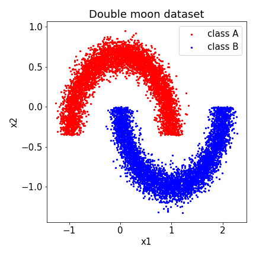
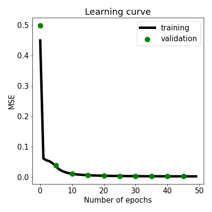
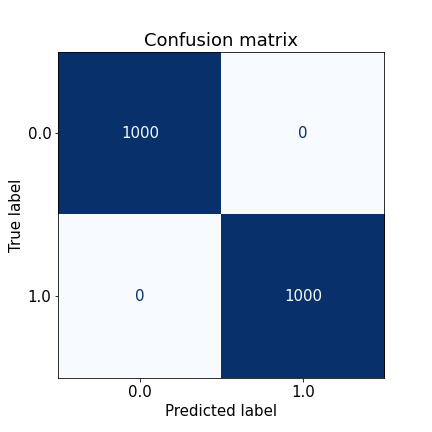

# Multilayer perceptron (1986)

## Multilayer perceptron for supervised machine learning.

### Table of Contents

- [Images](#images)
- [Description](#description)
- [Keywords](#keywords)
- [How to Use](#how-to-use)
- [References](#references)
- [Author Info](#author-info)

## Images

## Description

"Multilayer perceptron for supervised machine learning."

#### Technologies

- Python programming language

## Keywords

 - Feedforward neural network
 - Supervised learning
 - Double moon dataset
 - Logistic activation function
 - Backpropagation algorithm
 - Gradient descent
 - Loss minimization

## How to Use

#### Getting started

`gh repo clone berberianareg/Multilayer-perceptron`

#### Dependencies

see requirements.txt

#### Installation

`pip install numpy`

`pip install matplotlib`

`pip install sklearn`

#### Executing the program from command line

`python MLP.py`

## References

#### Links

- Relevant book - (https://www.amazon.com/Neural-Networks-Learning-Machines-3rd/dp/0131471392)

## Author Info

- Twitter - [@berberianareg](https://twitter.com/BerberianNareg)
- LinkedIn - [Nareg Berberian](https://www.linkedin.com/in/nareg-berberian-phd-ab6759b9/)

[Back to the Top](#multilayer-perceptron-1986)

